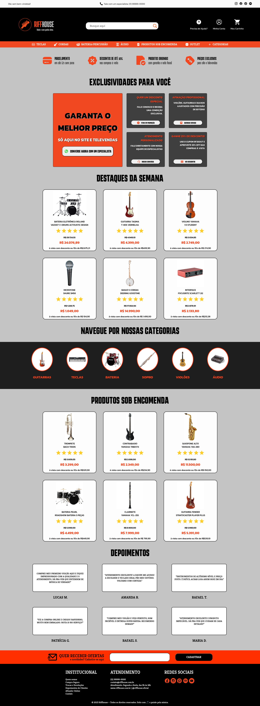

# 🎸 Riffhouse



<p align="center">
  
  
  
  
</p>

> Uma landing page fictícia para uma **loja de instrumentos musicais**, criada para praticar **HTML** e **CSS**, com foco em **layout comercial**, **componentização visual** e **experiência do usuário**.

---

## 🎯 Objetivo do Projeto

O projeto **Riffhouse** foi desenvolvido com fins educativos, com os seguintes objetivos:

- Praticar a construção de uma página inicial de **e-commerce**.
- Trabalhar hierarquia visual usando **tipografia, cores e grids**.
- Explorar a organização de seções comuns em lojas online:
  - Cabeçalho com navegação e busca
  - Seção de **destaques** e **produtos sob encomenda**
  - **Categorias** de instrumentos
  - **Depoimentos** de clientes
  - Área de **captura de e-mail** para ofertas
  - Rodapé com informações institucionais e redes sociais
- Exercitar boas práticas de **semântica HTML** e **estruturação de CSS**.

---

## 🧩 Tecnologias Utilizadas

- **HTML5** — estrutura da página  
- **CSS3** — estilização, layout em grid/flexbox e identidade visual  
- **Google Fonts** — tipografias Kanit, Karantina e Kreon para reforçar a estética da marca  

---

## 🛠️ Funcionalidades da Página

### ✔ Header com contato rápido
- Mensagem de boas-vindas  
- Telefone de atendimento  
- Ícones de redes sociais  
- Barra de busca e atalhos para:
  - Minha Conta  
  - Ajuda  
  - Meu Carrinho  

### ✔ Menu de navegação principal
Links diretos para:
- Teclas  
- Cordas  
- Bateria/Percussão  
- Áudio  
- Produtos sob encomenda  
- Outlet  
- Categorias  

### ✔ Seções de destaque comercial
Incluindo:
- **Exclusividades**, com CTAs e cards especiais  
- **Destaques da semana**, com:
  - Imagens de produtos
  - Preços e descontos
  - Descrição
  - Avaliações por estrelas  

### ✔ Produtos sob encomenda
Seção com instrumentos de alto valor e apresentação detalhada.

### ✔ Categorias de instrumentos
Cards circulares com ícones para:
- Guitarras  
- Teclas  
- Bateria  
- Sopro  
- Violões  
- Áudio  

### ✔ Depoimentos de clientes
Cards com feedback realista simulando opiniões de compradores.

### ✔ Newsletter
Área para captura de e-mail com CTA chamativo.

### ✔ Rodapé completo
Inclui:
- Links institucionais (Políticas, Quem Somos, Contato, etc.)
- Informações de atendimento  
- Redes sociais  
- Direitos autorais  

---

## 📸 Demonstração

Assim que houver deploy, adicione o link abaixo:

🔗 **Acessar Riffhouse**  
https://riffhouse.vercel.app/

---

## 📂 Como Executar o Projeto Localmente

Clone o repositório:

```bash
git clone https://github.com/Jeffersonmk/riffhouse.git
```

Acesse o diretório:

```bash
cd riffhouse
```

Abra o arquivo:

```bash
index.html
```

Ou use *Live Server* no VS Code.

---

## 📐 Estrutura de Arquivos

```bash
riffhouse/
├── index.html
├── style.css
├── LICENSE
├── README.md
└── images/
    ├── ad-header/
    ├── categoria-instrumentos/
    ├── destaque-icons/
    ├── destaque-instruments/
    ├── encomendas-instruments/
    ├── exclusive-icons/
    ├── footer-logos/
    ├── header-icon/
    ├── header-menu-social/
    ├── nav-menu/
    ├── ofertas-icons/
    └── preview/
```

---

## ⚖️ Licença

Este projeto está licenciado sob a **MIT License**.  
Você pode usar, copiar, modificar e distribuir livremente, desde que mantenha os créditos.

---

## 📌 Observações

- Projeto fictício, não representa uma loja real  
- Criado exclusivamente para estudo  
- Sinta-se livre para modificar tudo e transformar em algo maior  
